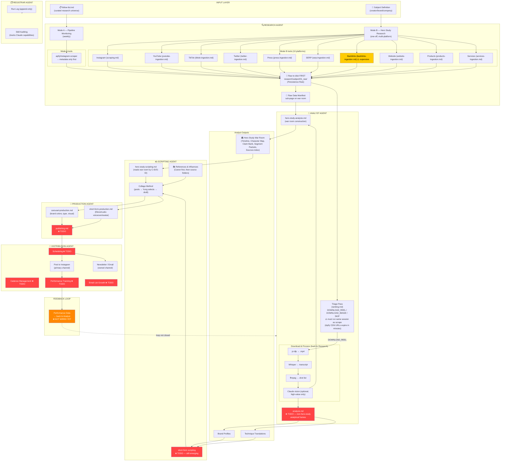

```mermaid
flowchart TD
    subgraph INPUT["INPUT LAYER"]
        FL["📋 follow-list.md\n(curated research universe)"]
        SUBJ["🎯 Subject Definition\n(creator/brand/company)"]
    end

    subgraph RESEARCH["🔍 RESEARCH AGENT"]
        direction TB
        MA["Mode A — Pipeline Monitoring\n(weekly)"]
        MB["Mode B — Hero Study Research\n(one-off, multi-platform)"]
        
        subgraph MA_TOOLS["Mode A tools"]
            APIFY["apify/instagram-scraper\n→ metadata only first"]
        end
        
        subgraph MB_TOOLS["Mode B tools (10 platforms)"]
            IG2["Instagram (scraping.md)"]
            YT2["YouTube (youtube-ingestion.md)"]
            TT["TikTok (tiktok-ingestion.md)"]
            TW["Twitter (twitter-ingestion.md)"]
            PR["Press (press-ingestion.md)"]
            SE["SERP (serp-ingestion.md)"]
            BL["Backlinks (backlinks-ingestion.md) ⚠️ expensive"]
            WB["Website (website-ingestion.md)"]
            PD["Products (products-ingestion.md)"]
            SV["Services (services-ingestion.md)"]
        end
        
        DISK["💾 Raw to disk FIRST\nresearch/subject/01_raw/\n(Persistence Rule)"]
        MANIFEST["📁 Raw Data Manifest\nsub-page on war room"]
    end

    subgraph ANALYST["🔬 ANALYST AGENT"]
        direction TB
        TRIAGE["Triage Pass\n(ranking.md)\nDOWNLOAD_REEL / DOWNLOAD_IMAGE / SKIP\n⚠️ must run same session as scrape\n(Apify CDN URLs expire in minutes)"]
        
        subgraph DL["Download & Process (back to Research)"]
            YTDLP["yt-dlp → .mp4"]
            WHISPER["Whisper → transcript"]
            FFMPEG["ffmpeg → shot list"]
            VISION["Claude vision (optional,\nhigh-value only)"]
        end
        
        ANALYSIS_HS["hero-study-analysis.md\n(war room construction)"]
        ANALYSIS_SF["analysis.md\n❌ TODO — non-hero-study\nanalytical frames"]
    end

    subgraph OUTPUTS_A["Analyst Outputs"]
        WARROOM["🏛️ Hero Study War Room\n(Timeline, Character Map,\nClaim Bank, Segment Packets,\nSources index)"]
        BP["Brand Profiles"]
        TT2["Technique Translations"]
    end

    subgraph SCRIPTING["✍️ SCRIPTING AGENT"]
        HS_SCRIPT["hero-study-scripting.md\n(reads war room by C-ID/S-ID)"]
        SF_SCRIPT["short-form scripting\n❌ TODO — still emerging"]
        COLLAGE["Collage Method\n(pools → Yung selects → draft)"]
        REFS["📚 References & Influences\n(Canon first, then source folders)"]
    end

    subgraph PRODUCTION["🚀 PRODUCTION AGENT"]
        CAROUSEL["carousel-production.md\n(brand colors, type, visual)"]
        SHORTFORM["short-form-production.md\n(ElevenLabs voiceover/avatar)"]
        PUBLISH["publishing.md\n❌ TODO"]
    end

    subgraph DISTRIBUTION["📡 DISTRIBUTION AGENT"]
        SCHED["Scheduling ❌ TODO"]
        CADENCE["Cadence Management ❌ TODO"]
        PERF["Performance Tracking ❌ TODO"]
        EMAILLIST["Email List Growth ❌ TODO"]
        POST["Post to Instagram\n(primary channel)"]
        NEWSLETTER["Newsletter / Email\n(owned channel)"]
    end

    subgraph FEEDBACK["FEEDBACK LOOP"]
        PERFDATA["Performance Data\n→ back to Analyst\n❌ NOT WIRED YET"]
    end

    subgraph REGISTRAR["🗂️ REGISTRAR AGENT"]
        RUNLOG["Run Log (append-only)"]
        SKILLAUDIT["Skill Auditing\n(tracks Claude capabilities)"]
    end

    %% Main flow
    FL --> MA
    SUBJ --> MB
    MA --> APIFY
    MB --> IG2 & YT2 & TT & TW & PR & SE & BL & WB & PD & SV
    APIFY --> DISK
    IG2 & YT2 & TT & TW & PR & SE & BL & WB & PD & SV --> DISK
    DISK --> MANIFEST

    DISK --> TRIAGE
    TRIAGE -->|"DOWNLOAD_REEL"| YTDLP
    YTDLP --> WHISPER --> FFMPEG --> VISION

    MANIFEST --> ANALYSIS_HS
    VISION --> ANALYSIS_HS
    VISION --> ANALYSIS_SF

    ANALYSIS_HS --> WARROOM
    ANALYSIS_SF --> BP & TT2

    WARROOM --> HS_SCRIPT
    BP & TT2 --> SF_SCRIPT
    HS_SCRIPT & SF_SCRIPT --> COLLAGE
    REFS --> COLLAGE

    COLLAGE --> CAROUSEL & SHORTFORM
    CAROUSEL & SHORTFORM --> PUBLISH

    PUBLISH --> SCHED
    SCHED --> POST & NEWSLETTER
    POST --> PERF
    PERF --> PERFDATA
    PERFDATA -.->|"loop not closed"| ANALYST

    RUNLOG -.-> REGISTRAR

    %% Break callouts
    style ANALYSIS_SF fill:#ff4444,color:#fff
    style SF_SCRIPT fill:#ff4444,color:#fff
    style PUBLISH fill:#ff4444,color:#fff
    style SCHED fill:#ff4444,color:#fff
    style CADENCE fill:#ff4444,color:#fff
    style PERF fill:#ff4444,color:#fff
    style EMAILLIST fill:#ff4444,color:#fff
    style PERFDATA fill:#ff8800,color:#fff
    style BL fill:#ffcc00,color:#000

    %% Legend note
    classDef built fill:#22aa44,color:#fff
    classDef partial fill:#ffcc00,color:#000
    classDef todo fill:#ff4444,color:#fff
    classDef warning fill:#ff8800,color:#fff
```
